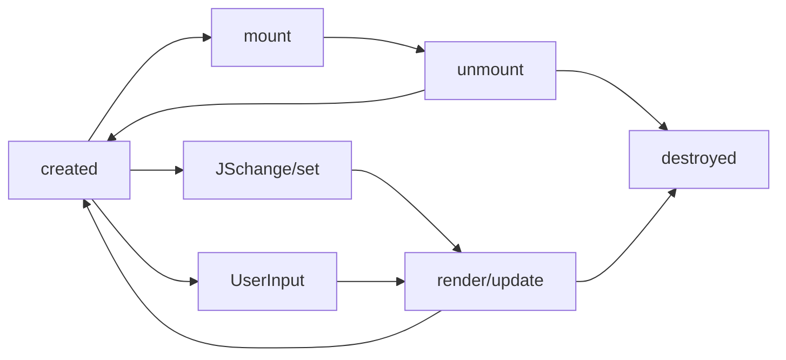

学习笔记
## 1 组件化
### 1.1. 组件的基本知识
1. 前端两大重点内容
- 组件化：解决复用问题
- 架构模式：如MVC、MVVM等，解决前端和数据逻辑层的交互问题

2. 组件的理解
组件可以看作特殊的对象和模块，它和UI是强相关的，是可复用的界面功能模块。它除了具有对象的property,method,inherit之外，还有attribute,state,children,event等，下图描述了组件组成部分间的关系


3. Attribute vs Property
- Attribute强调描述性
- Property强调从属关系
在html中，二者含义是不同的
```html
<input value="cute">
<script>
  var input = document.getElementByTagName("input"); // 若property没有设置，则结果是attribute
  input.value //cute
  input.getAttribute("value"); //cute
  input.value = "hello"; //若value属性已设置，则attribute不变，property变化，元素上实际的效果是property优先
  input.value // hello
  input.getAttribute("value"); //cute
</script>
```

4. 如何设计组件状态

|   |Markup set|JS set| JS Change| User Input Change|
|---|---|---|---|---|
|property|x|√|√|?|
|attribute|√|√|√|?|
|state|x|x|x|√|
|config|x|√|x|x|

5. 生命周期Lifecycle



### 1.2 为组件添加jsx语法
#### 1.2.1 搭建支持jsx语法的环境
jsx是babel的插件，因此要依次安装webpack,babel-loader, babel和babel-plugin
1. 安装webpack，用于静态模块打包
```npm install -g webpack webpack-cli```
2. 安装babel-loader，用于将其他语言的代码转译成webpack能够识别的语言(js或json)
```npm install --save-dev webpack babel-loader```
3. 安装babel用于将新版本的js编译成旧版本的js以便能跑在旧版本的浏览器中
```npm install --save-dev @babel/core @babel/preset-env```
4. 安装react-jsx插件用于在js中能够使用jsx
```npm install --save-dev @babel/plugin-transform-react-jsx```
5. 安装完后还要在webpack.config.js中将安装的各种库填写进配置文件中，如下
```js
module.exports = {
  entry: "./main.js",
  module: {
    rules: [
      {
        test: /\.js$/,
        use: {
          loader: "babel-loader",
          options: {
            presets: ["@babel/preset-env"],
            plugins: ["@babel/plugin-transform-react-jsx"]
          }
        }
      }
    ]
  },
  mode: "development"
}
```
### 1.3 JSX的基本使用方法
#### 1.3.1 JSX的原理
利用babel/plugin-transform-react-jsx插件将html标签写法转换成创建dom树的函数调用`createElement(type, attributes, ...children)`
#### 1.3.2 createElement函数的基本实现
```js
function createElement(type, attributes, ...children) {
  let element = document.createElement(type)
  for(let attr in attributes) {
    element.setAttribute(attr, attributes[attr])
  }
  for(let child of children) {
    if(typeof child === "string") {
      child = document.createTextNode(child)
    }
    element.appendChild(child)
  }
  return element
}
```
#### 1.3.3 增加对自定义标签的支持
```js
function createElement(type, attributes, ...children) {
  let element
  if(typeof type === "string")
    element = document.createElement(type)
  else 
    element = new type()
  for(let attr in attributes) {
    element.setAttribute(attr, attributes[attr])
  }
  for(let child of children) {
    if(typeof child === "string") {
      child = document.createTextNode(child)
    }
    element.appendChild(child)
  }
  return element
}

class Div{
  constructor() {
    this.root = document.createElement("div")
  }
  setAttribute(name, value) {
    this.root.setAttribute(name, value)
  }
  appendChild(child) {
    this.root.appendChild(child)
  }
  mountTo(parent) {
    parent.appendChild(this.root)
  }
}

let a = <Div id="a">
  <span>a</span>
  <span>b</span>
  <span>c</span>
</Div>

// document.body.appendChild(a)
a.mountTo(document.body)
```

#### 1.3.4 给原生html标签添加包装类使其支持mountTo方法
```js
export function createElement(type, attributes, ...children) {
  let element
  if(typeof type === "string")
    element = new ElementWrapper(type)
  else 
    element = new type()
  for(let attr in attributes) {
    element.setAttribute(attr, attributes[attr])
  }
  for(let child of children) {
    if(typeof child === "string") {
      child = new TextWrapper(child)
    }
    child.mountTo(element)
  }
  return element
}

export class Component {
  constructor(type) {
    this.root = this.render()
  }
  setAttribute(name, value) {
    this.root.setAttribute(name, value)
  }
  appendChild(child) {
    this.root.appendChild(child)
  }
  mountTo(parent) {
    parent.appendChild(this.root)
  }
}

class ElementWrapper extends Component {
  constructor(type) {
    this.root = document.createElement(type)
  }
}

class TextWrapper extends Component {
  constructor(content) {
    this.root = document.createTextNode(content)
  }
}
```

## 2 动手实现一个轮播组件
### 2.1 自动轮播
```js
  // 拷贝第一张图片用于自然过渡
    let img = document.createElement("div")
    img.style.backgroundImage = `url(${this.attributes.src[0]})`
    // img.style.backgroundColor = "blue"
    this.root.appendChild(img)


    let currentIdx = 0
    let time = 3000
    let that = this

    // 自动轮播
    let children = this.root.children
    let timer = setInterval( swiper
    // // 视频教程所用方法，第一轮播放过后轮播顺序是反的
    // let timer = setInterval(()=> {
    //   let nextIdx = (currentIdx + 1) % children.length

    //   // next快速移入viewport的后一个位置
    //   next.style.transition = "none"
    //   next.style.transform = `translationX(${100 - nextIdx*100}%)`

    //   setTimeout(()=>{// 实现current移出viewport,next移入viewport且next快速切换到current
    //     next.style.transition = "" // 恢复样式表中的transition设置
    //     current.style.transform = `translateX(${-100 - currentIdx*100}%)`
    //     next.style.transform = `translateX(${-nextIdx*100}%)`
    //     currentIdx = nextIdx
    //   }, 16)    
    // }
    , time)

    function swiper() {
      let children = that.root.children
      currentIdx++
      children[currentIdx-1].style.transform = `translateX(${-100*currentIdx}%)`
      children[currentIdx%children.length].style.transform = `translateX(${-100*currentIdx}%)`
      // for(let child of children) {
      //   child.style.transform = `translateX(${-100*currentIdx}%)` // 注意transition是相对于初始样式而非每次移动后的样式的
      // }
      if(currentIdx === children.length) {
        currentIdx = 0
        // 关闭过渡动画，重置各图片位置
        for(let child of children) {
          child.style.transition = "none"
          child.style.transform = `translateX(0)`
        }
        // 在下一帧恢复过渡动画
        setTimeout(()=>{
          for(let child of children) {
            child.style.transition = ""
          }
        }, 16)

          clearInterval(timer)
          timer = setInterval(swiper, 100) // 让最后一张和第一张短暂过渡
      }else if(currentIdx === 1) {
        clearInterval(timer)
        timer = setInterval(swiper, time)
      }
    }
```
### 2.2 手动轮播
```js
    // 手动控制轮播
    let position = 0
    this.root.addEventListener("mousedown", (event) => {
      let children = that.root.children
      let childrenLen = children.length-1
      let startX = event.clientX
      console.log("mousedown")
      let move = (event)=>{
        console.log("mousemove")
        let x = event.clientX - startX
        let current = position
        for(let offset of [-1, 0, 1]) {
          let pos = current + offset
          pos = (pos + childrenLen) % childrenLen // 将索引-1变为3
          children[pos].style.transition = "none"
          children[pos].style.transform = `translateX(${-pos*500 + offset*500 + x}px)`
        }
        // for(let child of children) {
        //   child.style.transition = "none" // 拖拽时关闭过渡动画
        //   child.style.transform =  `translateX(${-position*500 + x}px)` // -position*500为每次拖动时各图片相对于初始位置的偏移
        // }
      }
      let up = (event) => {
        let x = event.clientX - startX
        position = position - Math.round(x/500) // 获取松手时就近的帧索引
        for(let offset of [0, Math.sign(Math.abs(x)>250 ? x:-x)]) { 
          // 拖动距离大于视口的一半，当前图片和下一张图片跟着移动，否则当前图片和上一张图片跟着移动
          let pos = position + offset
          pos = (pos + childrenLen) % childrenLen // 将索引-1变为3
          children[pos].style.transition = ""
          children[pos].style.transform = `translateX(${-pos*500 + offset*500}px)`
        }
        // position = position - Math.round(x/500) // 获取松手时就近的帧索引
        // for(let child of children) {
        //   child.style.transition = ""
        //   child.style.transform =  `translateX(${-position*500}px)`
        // }
        console.log("mouseup")
        document.removeEventListener("mousemove", move)
        document.removeEventListener("mouseup", up)
      }
      // 在document上监听可以防止移出图片区域无法响应监听事件
      document.addEventListener("mousemove", move)
      document.addEventListener("mouseup", up)
    })

```

### 2.3 问题
1. 按照视频教程里面自动轮播的代码执行为何从第二轮开始轮播顺序是反的？