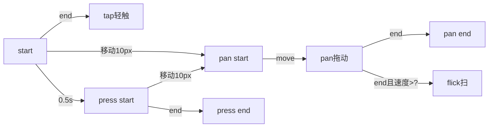

学习笔记——手势与动画

第14周开发的轮播组件虽然有两个功能，但无法集成到一起，也存在一些小问题的，需要加入动画和手势，动画和手势是开发组件所需要的底层能力
# 1 动画
## 1.1 初步建立动画和时间线
### 1.1.1 动画分类和实现方式
动画分为属性动画（属性动态变化）和帧动画（图片动态变化），浏览器中展现的多是属性动画

**动画的实现方式**

1. setInterval：存在时间积压的可能，不可控，不推荐
```js
setInterval(()=>{}, 16) // 16ms为浏览器的一帧时间
```
2. setTimeout
```js
const tick = ()=>{
  // 处理逻辑...
  setTimeout(()=>{}, 16)
}
```
3. requestAnimationFrame:请求在浏览器下一帧执行回调函数
```js
const tick = ()=>{
  // 处理逻辑...
  requestAnimationFrame(tick)
}
```
### 1.1.2 时间线
可以理解成管理动画的一个工具，可以实现动画的添加、删除、开始、暂停、重播等

## 1.2 设计时间线的更新
目的是可以动态地给时间线添加动画：
- 当动画的开始时间早于时间线的开始时间时，TICK中流逝的时间是相对于时间线开始时间；
- 当动画的开始时间晚于时间线的开始时间时，TICK中流逝的时间是相对于动画开始时间

## 1.3 给动画添加暂停和启动功能
- 暂停功能需要使用cancelAnimationFrame取消掉前面requestAnimationFrame返回的handler
- resume功能需要记录暂停后到resume的累计暂停时间并在resume时减去该时间

## 1.4 完善动画的其它功能
1. 增加delay功能
2. 增加timingFunction功能
3. 补全reset功能（将Timeline的所有属性重置）

## 1.5 给时间线添加状态管理

# 2 手势
## 2.1 手势的基本知识

## 2.2 实现鼠标和触摸操作
1. 鼠标的标准处理

在mousedown中监听document的mousemove和mouseup事件，在mouseup中移除document的mousemove和mouseup的监听
```js
// 鼠标操作
element.addEventListener("mousedown", event=>{
  let mousemove = event => {
    console.log(event.clientX, event.clientY)
  }
  let mouseup = event => {
    document.removeEventListener("mousemove", mousemove)
    document.removeEventListener("mouseup", mouseup)
  }

  document.addEventListener("mousemove", mousemove)
  document.addEventListener("mouseup", mouseup)
})
```
2. 触摸的处理
  
分别对touchstart, touchmove, touchend和touchcancel（触摸被其它事件异常中断）进行监听(touchstart触发时会同时触发touchmove)
```js
// 触摸操作
element.addEventListener("touchstart", event=>{
  for(let touch of event.changedTouches) { // changedTouches表示触发的多个触点
    console.log("touchstart")
  }
})

element.addEventListener("touchmove", event=>{
  for(let touch of event.changedTouches) {
    console.log(touch.clientX, touch.clientY)
  }
})

element.addEventListener("touchend", event=>{
  for(let touch of event.changedTouches) {
    console.log("touchend")
  }
})

element.addEventListener("touchcancel", event=>{
  for(let touch of event.changedTouches) {
    console.log("touchcancel")
  }
})
```

## 2.3 实现手势的逻辑

主要是实现识别2.1中tap,pan,press几种手势的功能

## 2.4 处理鼠标事件

将手势识别相关的变量封装到context中，以支持多点触摸和鼠标多键点击

几点注意：
1. 鼠标中键和右键的button属性值顺序和移动时的buttons顺序是相反的
2. 当鼠标多个键同时按下，需要避免多次界面绑定mousemove和mouseup监听，当没有鼠标键按下时再移除mousemove和mouseup监听
  
## 2.5 派发事件

目的是将识别手势事件的能力封装成API通过addEventListener派发给元素，派发事件可以使用new Event()

## 2.6 实现一个Flick事件

思路：需要计算触点的移动速度，当大于某一阈值时认为是flick事件

## 2.7 手势库的封装

处理流程：listener=>recongnizer=>dispatch

将各环节封装成单独的API导出，同时提供一个组合API将各环节串起来方便使用

调用方式：new Listener(element, new Recognizer(new Dispatcher(element)))