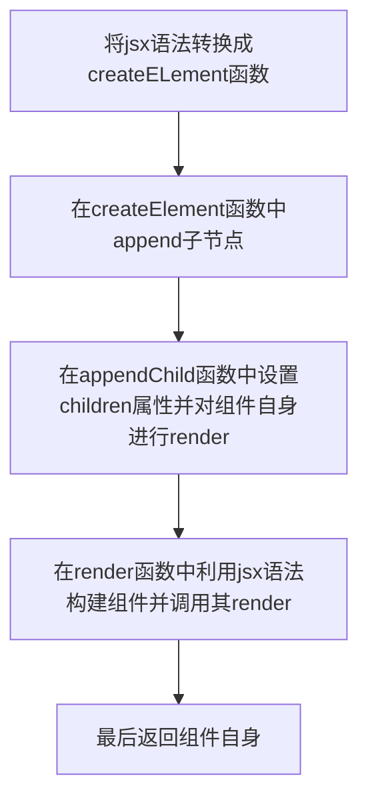

学习笔记
## 1 手势动画应用
### 1.1 将14周手动轮播实现替换成通过手势组件实现
```js
    // 手动控制轮播
    this.root.addEventListener("start", (event)=>{
      console.log("start")
    })
    
    this.root.addEventListener("pan", (event)=>{
      console.log("pan")
      let x = event.clientX - event.startX - ax
      let current = this[STATE].position - ((x-x%500)/500) // x - x % 500的值一定是500的倍数（自己把自己多余的给减去）
      for(let offset of [-1, 0, 1]) {
        let pos = current + offset
        pos = (pos%children.length + children.length) % children.length // pos可能是负很多，需要转换到[0, children.length)，如将索引-1变为3
        children[pos].style.transition = "none"
        children[pos].style.transform = `translateX(${-pos*500 + offset*500 + x%500}px)`
      }
    })
    
    this.root.addEventListener("end", (event)=>{
        console.log("end")
        let x = event.clientX - startX
        let current = position - Math.round(x/500) // 获取松手时就近的帧索引
        for(let offset of [0, Math.sign(Math.abs(x)>250 ? x:-x)]) { 
          // 拖动距离大于视口的一半，当前图片和下一张图片跟着移动，否则当前图片和上一张图片跟着移动
          let pos = current + offset
          pos = (pos + children.length) % children.length // 将索引-1变为3
          children[pos].style.transition = "" // 恢复过渡效果
          children[pos].style.transform = `translateX(${-pos*500 + offset*500}px)`
        }
    })
```
### 1.2 将14周自动轮播实现替换成通过动画组件实现
```js
    let handler = null  

    let nextPicture = ()=>{
      let children = this.root.children
      let nextIdx = (this[STATE].position + 1) % children.length
      let current = children[this[STATE].position]
      let next = children[nextIdx]
      // next快速移入viewport的后一个位置
      next.style.transition = "none"
      next.style.transform = `translateX(${500 - nextIdx*500}px)`

      tl.add(new Animation(current.style, "transform", -this[STATE].position*500, -500-this[STATE].position*500, 500, 0, ease, v=>`translateX(${v}px)`))
      tl.add(new Animation(next.style, "transform", 500 - nextIdx*500, -nextIdx*500, 500, 0, ease, v=>`translateX(${v}px)`))

      this[STATE].position = nextIdx
      this.triggerEvent("change", {position: this[STATE].position})

    }
    handler = setInterval(nextPicture, time)
```
曾遇到的问题：轮播图会跑飞，相邻两张轮播图移动的距离本应该相同，但实际运行结果却相差了500px

通过参照其它同学提交的代码，发现是自己笔误将
```js
      tl.add(new Animation(next.style, "transform", 500 - nextIdx*500, -nextIdx*500, 500, 0, ease, v=>`translateX(${v}px)`))
```
错写成了
```js
      tl.add(new Animation(next.style, "transform", 500 - nextIdx*500, -nextIdx*500, 500, 0, ease, v=>`translateX(${v})px`))
```

### 1.3 将自动轮播和手动轮播利用时间线结合起来
1. 在start的事件回调中，停止自动轮播的时间线并清除自动轮播定时器
2. 在pan的事件回调中，为了能从自动轮播自然过渡到手动轮播，需要加上自动轮播的偏移量
3. 在panend的事件回调中，原有的取巧处理不适合结合时间线，基于pan的回调函数逻辑进行处理

```js
   // 手动控制轮播
    this.root.addEventListener("start", (event)=>{
      console.log("start")
      tl.pause()
      clearInterval(handler)
      let progress = tl.getAnimeRunTime() / 500
      ax = ease(progress) * 500 - 500
    })

    this.root.addEventListener("pan", (event)=>{
      console.log("pan")
      let x = event.clientX - event.startX - ax // 减去动画已移动的距离避免拖动时产生跳变
      let current = this[STATE].position - ((x-x%500)/500) // x - x % 500的值一定是500的倍数（自己把自己多余的给减去）
      for(let offset of [-1, 0, 1]) {
        let pos = current + offset
        pos = (pos%children.length + children.length) % children.length // pos可能是负很多，需要转换到[0, children.length)，如将索引-1变为3
        children[pos].style.transition = "none"
        children[pos].style.transform = `translateX(${-pos*500 + offset*500 + x%500}px)`
      }
    })

      this.root.addEventListener('panend', (event) => {        
        // 与时间线结合时基于pan的逻辑修改，原先的逻辑因为偷懒，结构不好调整
        console.log("panend")
        tl.reset()
        tl.start()
        handler = setInterval(nextPicture, time)
        let x = event.clientX - event.startX - ax
        let direction = Math.round((x%500)/500)
        if(event.isFlick) {
          console.log(event.velocity)
          if(direction > 0) {
            direction = Math.ceil((x%500)/500)
          }else if(direction < 0) {
            direction = Math.floor((x%500)/500)
          }
        }
        
        let current = this[STATE].position - ((x-x%500)/500) // x - x % 500的值一定是500的倍数（自己把自己多余的给减去）
        for(let offset of [-1, 0, 1]) {
          let pos = current + offset
          pos = (pos%children.length + children.length) % children.length // pos可能是负很多，需要转换到[0, children.length)，如将索引-1变为3
          children[pos].style.transition = "none"
          //children[pos].style.transform = `translateX(${-pos*500 + offset*500 + x%500}px)`
          tl.add(new Animation(children[pos].style, "transform", 
                -pos*500 + offset*500 + x%500,  
                -pos*500 + offset*500 + direction*500,
                500, 0, ease, v=>`translateX(${v}px)`))// 动画从pan结束处开始
        }
        
        this[STATE].position = current - direction
        this[STATE].position = (this[STATE].position%children.length + children.length) % children.length 
        this.triggerEvent("change", {position: this[STATE].position})

      })
```
其中多次用到2个取余技巧：
1. 对某数取整：(x-x%500)/500
2. 将任意数取余转换到[0, n)区间：(pos%children.length + children.length) % children.length

## 2 为组件添加更多属性
1. 将carousel类与Component父类重复的方法抽取到父类中
2. 将position属性和attribute属性利用Symbol抽取到父类中
3. 给组件添加onChange事件获取position的状态改变
4. 给组件添加onClick事件跳转到图片链接的网站

## 3 给组件加入children机制
1. 内容型children：组件内所写字符串即代表了children，见Button示例
```js
let b = <Button>
  <span>content</span>
</Button>
b.mountTo(document.body)
```

2. 模板型children：通过模板函数去生成，如列表项，见List示例
```js
import {Component, createElement, ATTRIBUTE} from "./framework.js"
export class List extends Component{
  constructor() {
    super()
  }
  render() {
    this.root = (<div>{this.children}</div>).render() // 要在createElement中加入递归处理数组的逻辑
    return this.root
  }
  appendChild(child) {
    this.template = (child)
    this.children = this[ATTRIBUTE].data.map(this.template) // template是传入的模板回调函数
    this.render()
  }
}

let c = <List data={d}>
  {(record)=>
    <div>
      
      <a href={record.url}>{record.title}</a>
    </div>
  }
</List>
c.mountTo(document.body)
```


两种组件的大致生成逻辑类似，如下图所示：


唯一不同的是模板型children组件的children并不能直接得到，而是要利用传入组件的模板函数作用于组件数据得到


## 4 总结
在本文中我们主要将组件实战化2博客中的手势和动画库应用到了组件实战化1博客中编写的原始轮播图组件中，使我们的轮播图组件能在自动轮播和手动轮播之间自然过渡。由于使用的手势库封装了鼠标操作和触控操作，我们实现的轮播图组件也能够跨端使用。我们还给轮播图组件增加了onChange、onClick事件属性以及表示当前轮播图序号的position属性，可以实现点击轮播图跳转到关联的网页，扩展了组件的功能。最后，简单介绍了给组件添加children的机制，使得我们能够对组件进行嵌套和组合，在组件中加入原生html标签和按照模板生成重复型子组件。